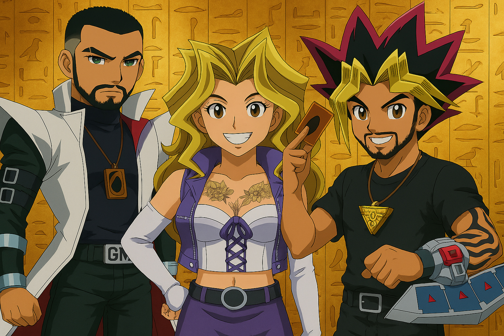

# YuGiOh-Unrestricted

**YuGiOh-Unrestricted** is a personal learning project that simulates a multiplayer **Yu-Gi-Oh!** card game using .NET 7 web technologies.  
The project is driven by nostalgia for the classic Yu-Gi-Oh! TCG and a desire to learn multiplayer game development.  
It provides an interactive platform for friendly duels and showcases real-time gameplay features built with Blazor Server, SignalR, and EF Core in a fun, nostalgic context.

The **“Unrestricted”** name highlights the freedom given to players: instead of enforcing a single official banlist or format, the system lets players define their own rules.  
They can decide which generations of cards, custom restrictions, or house rules to apply, coordinating these agreements through any external communication channel of their choice.

---

## Features

- **Deck Builder** – Build and customize your own decks through a user-friendly web interface. Create the perfect deck from a vast card pool and save it for your next duel.  
- **Real-Time Duels** – Challenge other players in live duels with real-time gameplay. Game state is synchronized instantly between players using SignalR, making each duel feel responsive and authentic.  
- **Card Import via API** – Card data (name, type, level, ATK, DEF, etc.) is imported through an external API (e.g. YGOPRODeck) and **stored locally in the SQLite database**.  
  Card images, however, are **not stored or distributed** — they are always loaded dynamically via external URLs at runtime.  
- **Online Lobby** – A simple lobby system to select decks and start duels. Players use this interface only to prepare for matches (no built-in chat or communication).  

---

## Technologies Used

- **.NET 7.0** – Core framework for the entire solution, with NuGet dependencies aligned to version **7.0.9**.  
- **Blazor Server** – Interactive front-end UI created using Blazor Server templates in .NET 7.0, allowing rich dynamic web pages using C# and Razor.  
- **SignalR** – Real-time communication library for handling live duel interactions (sends game updates instantly to all players, enabling synchronized gameplay).  
- **Entity Framework Core (with SQLite)** – Handles server-side data persistence. A lightweight SQLite database is used to store card information (names, types, levels, ATK, DEF), user data, decks, and matches.  

---

## Inspiration

One of the biggest motivations for creating this project came from my weekend duels at my brother’s house.  
To celebrate that, here’s a fun AI-generated artwork of us:  

  

  Me as Kaiba | My brother’s wife as Mai Valentine | My brother as Yugi 
  *Image generated using AI*

---

## Disclaimer

This is a **fan-made project** created for educational purposes and personal enjoyment.  
It is **not affiliated with or endorsed by Konami** or the official Yu-Gi-Oh! franchise in any way.  
All Yu-Gi-Oh! characters, cards, and names are trademarks of their respective owners.  

---

## Author

Developed by **Gustavo Mariano**  
[GitHub](https://github.com/GustavoMariano) | [LinkedIn](https://www.linkedin.com/in/gustavo-mariano)

---

*Trust in the Heart of the Cards.*  
*It’s time to duel!*  

