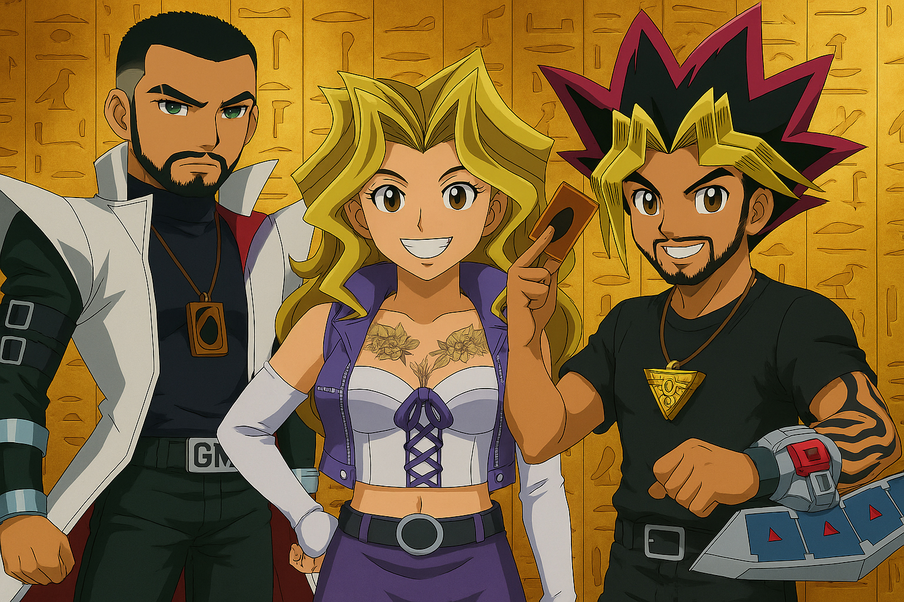

# YuGiOh-Unrestricted

[English](README.md) | [Português](README.pt-BR.md)

**YuGiOh-Unrestricted** é um projeto pessoal de aprendizado que simula um jogo de cartas **Yu-Gi-Oh!** multiplayer utilizando tecnologias .NET 7.  
O projeto foi motivado pela nostalgia do clássico Yu-Gi-Oh! TCG e pela vontade de aprender sobre desenvolvimento de jogos multiplayer na web.  
Ele fornece uma plataforma interativa para duelos amigáveis e demonstra recursos de jogo em tempo real construídos com Blazor Server, SignalR e EF Core em um contexto divertido e nostálgico.

O nome **“Unrestricted”** destaca a liberdade dada aos jogadores: em vez de impor uma banlist oficial ou formato único, o sistema permite que os próprios jogadores definam suas regras.  
Eles podem decidir quais gerações de cartas, restrições personalizadas ou regras alternativas aplicar, combinando previamente ou durante o duelo através de qualquer canal de comunicação externa de sua escolha.

---

## Funcionalidades

- **Construtor de Decks** – Crie e personalize seus decks através de uma interface intuitiva. Monte o deck perfeito a partir de uma vasta coleção de cartas e salve-o para o próximo duelo.  
- **Duelos em Tempo Real** – Desafie outros jogadores em duelos online em tempo real. O estado do jogo é sincronizado instantaneamente entre os jogadores usando SignalR, tornando cada duelo responsivo e autêntico.  
- **Importação de Cartas via API** – Dados das cartas (nome, tipo, nível, ATK, DEF, etc.) são importados de uma API externa (por exemplo, YGOPRODeck) e **armazenados localmente em um banco SQLite**.  
  As imagens das cartas, no entanto, **não são armazenadas nem distribuídas** — elas são sempre carregadas dinamicamente através de URLs externos em tempo de execução.  
- **Lobby Online** – Um sistema simples de lobby para selecionar decks e iniciar duelos. Os jogadores usam essa interface apenas para se preparar para a partida (não há chat embutido).  

---

## Tecnologias Utilizadas

- **.NET 7.0** – Framework principal da solução, com dependências NuGet alinhadas à versão **7.0.9**.  
- **Blazor Server** – Interface web interativa criada com templates do Blazor Server em .NET 7.0, permitindo páginas dinâmicas em C# e Razor.  
- **SignalR** – Biblioteca para comunicação em tempo real, responsável por manter a sincronização dos duelos entre os jogadores.  
- **Entity Framework Core (com SQLite)** – Gerencia a persistência de dados no servidor. O banco de dados SQLite armazena informações sobre cartas (nome, tipo, nível, ATK, DEF), usuários, decks e partidas.  

---

## Inspiração

Uma das maiores motivações para criar este projeto veio dos duelos de fim de semana na casa do meu irmão.  
Para celebrar isso, aqui está uma arte divertida gerada por IA representando a gente:  

  

  Eu como Kaiba | Esposa do meu irmão como Mai Valentine | Meu irmão como Yugi 
  *Imagem gerada por IA*

---

## Aviso Legal

Este é um **projeto feito por fã**, criado apenas para fins educacionais e de diversão pessoal.  
Ele **não possui afiliação nem é endossado pela Konami** ou pela franquia oficial Yu-Gi-Oh!.  
Todos os personagens, cartas e nomes de Yu-Gi-Oh! são marcas registradas de seus respectivos proprietários.  

---

## Autor

Desenvolvido por **Gustavo Mariano**  
[GitHub](https://github.com/GustavoMariano) | [LinkedIn](https://www.linkedin.com/in/gustavo-mariano)

---

*Confie no Coração das Cartas.*  
*É hora do duelo!*  

